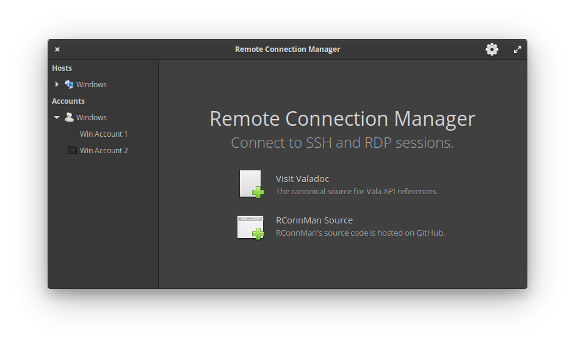

    

# Remote Connection Manager

Remote Connection Manager is my own very first starter project for building an App for the Elementary OS. 

The initial plan is for it to create connections to remote systems using SSH, Telnet and RDP.

## Screenshots

